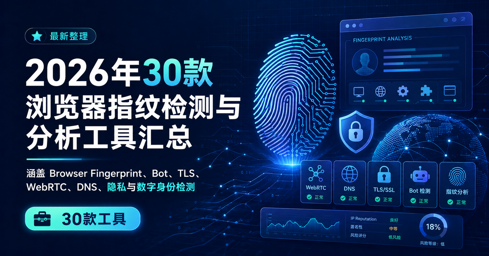

https://github.com/user-attachments/assets/d6759923-58d4-4d9e-8daa-7b95d173b0e2
# 2026年30款浏览器指纹检测与分析工具 / Browser Fingerprint Checkers

A maintained directory of **30 browser fingerprint, environment consistency, network, automation, privacy and digital-identity analysis tools**.

> **Last verified:** 2026-08-09  
> 本仓库是《2026年30款浏览器指纹检测与分析工具汇总》的持续维护版，主要维护工具状态、分类、来源和结构化数据。  
> 📖 [阅读完整文章与截图](https://web4browser.io/cn/blog/2026%E5%B9%B430%E6%AC%BE%E6%B5%8F%E8%A7%88%E5%99%A8%E6%8C%87%E7%BA%B9%E6%A3%80%E6%B5%8B%E4%B8%8E%E5%88%86%E6%9E%90%E5%B7%A5%E5%85%B7%E6%B1%87%E6%80%BB%E6%9C%80%E6%96%B0%E6%95%B4%E7%90%86)

## 浏览器指纹检测工具是什么

浏览器在访问网站时，会暴露大量与设备、系统、浏览器和网络环境有关的信息，例如 User-Agent、操作系统、屏幕分辨率、语言、时区、字体、Canvas、WebGL、WebGPU、AudioContext、WebRTC、Client Hints，以及 IP、DNS、TLS 和 HTTP 等网络与协议特征。网站可以将这些信号单独或组合起来形成浏览器指纹，并用于设备识别、访问分析、反欺诈、Bot 检测、风险控制和用户追踪。

浏览器指纹检测与分析工具可以帮助用户查看当前浏览器究竟暴露了哪些信息，并进一步判断浏览器、操作系统、硬件、网络和地理位置之间是否存在异常或不一致。有些工具专门分析 Canvas、WebGL、Fonts 等浏览器指纹，有些工具则进一步检测 WebRTC、DNS、Proxy、VPN、TLS、JA3/JA4、HTTP/2、自动化特征、Bot 风险、环境一致性或浏览器指纹唯一性。

本仓库整理了 30 款浏览器指纹、网络环境和数字身份检测工具。除了 BrowserLeaks、Pixelscan、BrowserScan、CreepJS、TraceScope 等浏览器环境分析网站，还包括 TLS/HTTP 指纹、Bot Detection、IP Reputation、Visitor Identification、浏览器隐私防护和数字身份暴露等不同方向。

这些工具可用于浏览器隐私检查、浏览器环境测试、Proxy/VPN 网络检查、WebRTC 和 DNS 泄漏排查、自动化浏览器调试、浏览器环境一致性验证，以及浏览器指纹和设备识别技术研究。不同工具关注的检测层并不相同，因此本仓库不做“最好/最强”排名，而是重点维护每款工具的检测方向、独特点、当前状态、来源和更新时间。

## 30款浏览器指纹检测与分析工具快速对比

这 30 款工具并不是功能完全相同的 Browser Fingerprint Checker。有些更适合快速判断完整浏览器环境，有些专门查看 Canvas、WebGL、TLS 等底层信号，还有一些重点检测 Bot、自动化、网络泄漏、浏览器隐私防护或数字身份暴露。

如果只是想快速找到适合自己的工具，可以先通过下面的表格了解每款工具主要解决什么问题，再进入后面的分类目录查看简要说明。更详细的结构化字段保存在 [`data/tools.csv`](data/tools.csv)。

| Tool | Category | Best for | Status |
|---|---|---|---|
| [BrowserScan](https://www.browserscan.net/) | 综合环境与一致性检测 | 快速检查完整浏览器环境 | Active |
| [Pixelscan](https://pixelscan.net/) | 综合环境与一致性检测 | 判断环境是否存在明显异常 | Active |
| [Iphey](https://iphey.com/) | 综合环境与一致性检测 | 快速判断环境可信度 | Active |
| [Whoer](https://whoer.net/) | 综合环境与一致性检测 | VPN/Proxy 环境检查 | Active |
| [Fingerprint-Scan](https://fingerprint-scan.com/) | 综合环境与一致性检测 | 检查指纹是否具有自动化特征 | Active |
| [TraceScope](https://tracescope.org/) | 综合环境与一致性检测 | 检查浏览器环境是否存在伪装或异常 | Active |
| [BrowserLeaks](https://browserleaks.com/) | 深度浏览器指纹分析 | 深入分析具体指纹参数 | Active |
| [CreepJS](https://abrahamjuliot.github.io/creepjs/) | 深度浏览器指纹分析 | 检查指纹伪装和异常 | Active |
| [DeviceInfo.me](https://www.deviceinfo.me/) | 深度浏览器指纹分析 | 深入查看设备暴露信息 | Active · access may vary |
| [WebBrowserTools](https://webbrowsertools.com/) | 深度浏览器指纹分析 | 检查指纹是否被修改 | Active |
| [Browserize / PrivacyCheck](https://privacycheck.sec.lrz.de/) | 深度浏览器指纹分析 | 研究高级指纹技术 | Active |
| [AmIUnique](https://amiunique.org/) | 唯一性与设备识别 | 判断指纹是否罕见 | Active |
| [EFF Cover Your Tracks](https://coveryourtracks.eff.org/) | 唯一性与设备识别 | 判断浏览器被追踪难度 | Active |
| [FingerprintJS OSS Demo](https://fingerprintjs.github.io/fingerprintjs/) | 唯一性与设备识别 | 理解网站如何生成 Visitor ID | Active |
| [Fingerprint Pro Playground](https://demo.fingerprint.com/playground) | 唯一性与设备识别 | 研究商业设备识别 | Active |
| [Incolumitas Bot Detector](https://bot.incolumitas.com/) | Bot / Automation Detection | 综合 Bot/自动化检测 | Active |
| [Rebrowser Bot Detector](https://bot-detector.rebrowser.net/) | Bot / Automation Detection | 调试 Playwright/Puppeteer | Active |
| [Sannysoft](https://bot.sannysoft.com/) | Bot / Automation Detection | 基础 Automation 检查 | Active |
| [Device & Browser Info](https://deviceandbrowserinfo.com/are_you_a_bot) | Bot / Automation Detection | 自动化浏览器调试 | Active |
| [AntCpt reCAPTCHA v3 Score](https://antcpt.com/eng/information/demo-form/recaptcha-3-test-score.html) | Bot / Automation Detection | 判断当前访问的人机风险 | Active |
| [TLS.Peet.ws / TrackMe](https://tls.peet.ws/) | TLS / 网络与 IP | 检查 TLS/HTTP 客户端身份 | Active |
| [IPLeak](https://ipleak.net/) | TLS / 网络与 IP | VPN/Proxy 泄漏排查 | Active |
| [IPQualityScore](https://www.ipqualityscore.com/ip-reputation-check) | TLS / 网络与 IP | 判断 IP 风险质量 | Active |
| [Ethical Red](https://www.ethicalred.io/) | TLS / 网络与 IP | 检查 VPN 是否真正完整接管流量 | Active |
| [LeaksCheck](https://leakscheck.com/) | 隐私、安全与数字身份 | 检查历史身份暴露 | Active |
| [Webkay](https://webkay.robinlinus.com/) | 隐私、安全与数字身份 | 理解网站能知道什么 | Active |
| [PrivacyTests.org](https://privacytests.org/) | 隐私、安全与数字身份 | 比较浏览器抗追踪能力 | Active |
| [BrowserAudit](https://browseraudit.com/) | 隐私、安全与数字身份 | 浏览器安全能力分析 | Active |
| [PrivacyTestLab](https://privacytestlab.com/) | 隐私、安全与数字身份 | 理解评分和指纹唯一性 | Active |
| [Privacy.net Analyzer](https://privacy.net/analyzer/) | 隐私、安全与数字身份 | 检查浏览器身份泄漏 | Active |

## 按用途分类

逐工具状态与核查日期以快速对比表和 [`data/tools.csv`](data/tools.csv) 为准；下面只保留用途说明与独特点，避免重复信息。

### 综合环境与一致性检测

#### [BrowserScan](https://www.browserscan.net/)

综合浏览器与网络环境检测工具，覆盖 IP、DNS、WebRTC、Canvas、WebGL、WebGPU、Client Hints 与 TLS/HTTP2 等信号，适合快速查看一个完整环境是否存在明显不一致。

**Highlights:** 环境一致性 + JA3/JA4/HTTP2  

https://github.com/user-attachments/assets/cb894aa2-cd98-44d0-ad50-59f5a9228e59

#### [Pixelscan](https://pixelscan.net/)

把浏览器指纹、Proxy、VPN、DNS、WebRTC、IP Reputation 和 Bot 信号集中到同一面板，并提供 Android Checker。

**Highlights:** 多维环境检测 + Android Checker  

https://github.com/user-attachments/assets/d825e8ad-6ab8-4717-8980-270fa9ef2b29

#### [Iphey](https://iphey.com/)

综合浏览器、硬件、软件与网络信号，并通过 Trust Score 帮助判断环境是否自然、一致。

**Highlights:** 强调不同信号之间的一致性  

https://github.com/user-attachments/assets/45cb50c2-a9bc-464f-a4d2-e95e45ea1ea7

#### [Whoer](https://whoer.net/)

从匿名性与网络泄漏角度检查 IP、DNS、WebRTC、Proxy、VPN、Timezone、语言和 User-Agent 等环境信息。

**Highlights:** 将多种环境不一致直接转化为风险项  

https://github.com/user-attachments/assets/c0c3c89f-efdd-4800-be65-dd631669047d

#### [Fingerprint-Scan](https://fingerprint-scan.com/)

将浏览器指纹、IP Reputation 和 Proxy Detection 组合进 Bot Risk Score，并关注 User-Agent 与真实环境之间的矛盾。

**Highlights:** 将指纹异常直接用于 Bot 风险判断  

https://github.com/user-attachments/assets/cc37f247-36f3-461d-aa83-fd97d32f9bc6

#### [TraceScope](https://tracescope.org/)

浏览器指纹与网络环境一致性诊断工具，强调 Server/JavaScript 交叉验证、Modification Traces 和可解释证据链。

**Highlights:** 修改痕迹、Server/JS 交叉验证、品牌痕迹  

https://github.com/user-attachments/assets/c3f704d8-fc68-49ac-8d37-510ea94c840b

### 深度浏览器指纹分析

#### [BrowserLeaks](https://browserleaks.com/)

模块化浏览器与网络指纹分析平台，可逐项查看 Canvas、WebGL、WebGPU、WebRTC、TLS、HTTP/2、JA3/JA4、JA4T 与 QUIC/HTTP3 等原始信号。

**Highlights:** JA4T、HTTP/2、QUIC/HTTP3 等协议层检测  

https://github.com/user-attachments/assets/cc4f0cc0-221a-4679-84d6-790966abdd80

#### [CreepJS](https://abrahamjuliot.github.io/creepjs/)

高级浏览器指纹研究工具，除了高熵信号外还重点检查 Lies、Resistance、Headless、Stealth、Worker 与主线程差异等异常。

**Highlights:** Lies、Resistance、Headless、Stealth  

https://github.com/user-attachments/assets/3589c689-b678-4e15-8cda-5a0e257d1e1a

#### [DeviceInfo.me](https://www.deviceinfo.me/)

提供大量设备、浏览器、硬件与网络原始信息，并包含 True Browser/OS 与 Fingerprinting Resistance 等检测。

**Highlights:** True Browser/OS 与 Fingerprinting Resistance  

https://github.com/user-attachments/assets/bfd92fd9-daf7-4cd1-9d12-5d692522a112

#### [WebBrowserTools](https://webbrowsertools.com/)

针对 Canvas、WebGL、WebGPU、ClientRects 等单项指纹面进行检测，并尝试识别固定或随机 Noise / Spoofing。

**Highlights:** Fixed/Random Noise Detection  

https://github.com/user-attachments/assets/96b237c4-7f44-4bb4-9b35-57ba134a38da

#### [Browserize / PrivacyCheck](https://privacycheck.sec.lrz.de/)

研究型 Fingerprinting 实验平台，覆盖 Active/Passive Fingerprinting，并包含 ETag、JSEcho、Header Signature 与 HTTP/2 等少见测试。

**Highlights:** ETag、JSEcho、Header Signature、HTTP2  

https://github.com/user-attachments/assets/1022f8a1-a310-46e3-b506-c6372409db4d

### 唯一性与设备识别

#### [AmIUnique](https://amiunique.org/)

研究浏览器指纹唯一性与时间变化，可将当前指纹与全球样本统计、历史记录和 Timeline 进行比较。

**Highlights:** Global Statistics + Fingerprint History  

https://github.com/user-attachments/assets/be151b44-7b72-4ce5-ad7d-1d61716dc4b7

#### [EFF Cover Your Tracks](https://coveryourtracks.eff.org/)

EFF 的隐私研究工具，用于观察 Tracker Protection 与 Fingerprintability，更偏向回答浏览器有多容易被跟踪。

**Highlights:** 同时分析 Tracker Protection  

https://github.com/user-attachments/assets/0b9410e3-762b-4ea0-89de-41437aa3ce06

#### [FingerprintJS OSS Demo](https://fingerprintjs.github.io/fingerprintjs/)

FingerprintJS 开源客户端指纹库的在线 Demo，用于观察浏览器属性如何被组合成 Visitor ID。

**Highlights:** 可实际部署的开源指纹算法  

https://github.com/user-attachments/assets/a2108806-f8dd-477b-911e-1ed528fcfb30

#### [Fingerprint Pro Playground](https://demo.fingerprint.com/playground)

Fingerprint 商业 Device Intelligence 的演示环境，展示服务端 Visitor Identification 与 Bot、VPN、Tampering 等 Smart Signals。

**Highlights:** 客户端 + 服务端持续设备识别  

### Bot / Automation Detection

#### [Incolumitas Bot Detector](https://bot.incolumitas.com/)

综合 Bot/Headless 检测工具，将 Browser、TCP/IP、TLS、Proxy/VPN 与 Behavioral Classification 等多层信号结合起来。

**Highlights:** 行为分类 + 多层指纹  

https://github.com/user-attachments/assets/63463f8e-0fb9-4183-9d5c-aea95ae8b9de

#### [Rebrowser Bot Detector](https://bot-detector.rebrowser.net/)

面向现代 Chromium 自动化环境，专门检查 CDP、Puppeteer、Playwright 等框架可能留下的执行痕迹。

**Highlights:** 专攻现代 CDP/Automation Leak  

https://github.com/user-attachments/assets/d6b5684e-5946-460c-b033-948460690a1b

#### [Sannysoft](https://bot.sannysoft.com/)

经典 WebDriver / Headless Browser 检测基准，长期用于 Selenium、Puppeteer、Playwright 与反检测环境的基础排查。

**Highlights:** 行业常用经典自动化基准  

https://github.com/user-attachments/assets/70e72ae1-846d-4ab2-9a15-928c4350ebbe

#### [Device & Browser Info](https://deviceandbrowserinfo.com/are_you_a_bot)

把客户端指纹、HTTP Headers、WebDriver/CDP 异常和行为测试放在一起，适合研究自动化环境中的跨信号差异。

**Highlights:** 同时检查静态指纹和用户行为  

https://github.com/user-attachments/assets/aabaa326-745d-4344-8478-df631f22d3ad

#### [AntCpt reCAPTCHA v3 Score](https://antcpt.com/eng/information/demo-form/recaptcha-3-test-score.html)

通过真实 reCAPTCHA v3 Score 观察外部风控系统对当前访问的人机风险判断，而不是读取传统 Canvas/WebGL 指纹。

**Highlights:** 直接观察 Google 风控评分  

https://github.com/user-attachments/assets/847e80d6-be5b-4556-b3af-e21b01d48670

### TLS / 网络与 IP

#### [TLS.Peet.ws / TrackMe](https://tls.peet.ws/)

专门分析 TLS 与 HTTP 客户端协议指纹，可直接查看 JA3、JA4、Akamai HTTP Fingerprint、PeetPrint 和 HTTP/2 Frames。

**Highlights:** JA3 + JA4 + Akamai + PeetPrint  

https://github.com/user-attachments/assets/3567919c-7207-4421-9975-b13323a2e9ed

#### [IPLeak](https://ipleak.net/)

面向 IP、DNS、WebRTC 与 VPN/Proxy 泄漏排查，并提供 Torrent Client IP 和不同端口网络路径测试。

**Highlights:** Torrent Client IP + 端口路由测试  

https://github.com/user-attachments/assets/7674edbe-c6c9-49e7-986d-037ae96b2638

#### [IPQualityScore](https://www.ipqualityscore.com/ip-reputation-check)

从 IP Reputation、Proxy/VPN/Tor、Abuse 与 Fraud Risk 等网络信誉数据评估当前 IP 风险。

**Highlights:** 自有网络信誉和欺诈数据  

https://github.com/user-attachments/assets/e4e20d51-f6ea-4fca-a3bf-3cb869f01fde

#### [Ethical Red](https://www.ethicalred.io/)

网络路径与 VPN 泄漏诊断工具，将 WebRTC、STUN、DNS、IPv6 与 VPN Tunnel Integrity 分开检查。

**Highlights:** STUN + VPN Tunnel Integrity  

https://github.com/user-attachments/assets/b1916c7f-bd0a-425a-bbe6-95c223e859a3

### 隐私、安全与数字身份

#### [LeaksCheck](https://leakscheck.com/)

从浏览器之外的身份层检查 Credential、Infostealer Logs、OSINT 与 Digital Footprint，用于发现历史身份暴露和可关联痕迹。

**Highlights:** 浏览器之外的身份关联和数字足迹 

https://github.com/user-attachments/assets/90e6d974-0d32-4e50-8586-9603a78eb14d

#### [Webkay](https://webkay.robinlinus.com/)

以可视化方式演示网站能从浏览器获得什么信息，并覆盖 Autofill、登录状态、Clickjacking 与本地网络等身份暴露场景。

**Highlights:** Autofill、登录状态、局域网等攻击面  

https://github.com/user-attachments/assets/40ae8570-6192-4e77-80d7-c0bf64704ec7

#### [PrivacyTests.org](https://privacytests.org/)

使用统一自动化测试横向比较不同浏览器默认设置下的隐私与抗追踪能力，而不是检测单个 Profile。

**Highlights:** 统一方法横向比较不同浏览器  

https://github.com/user-attachments/assets/6929770f-13bd-4614-a85f-e146f02de3c6

#### [BrowserAudit](https://browseraudit.com/)

通过数百项自动化测试检查浏览器对 SOP、CSP、CORS、Cookies 等 Web Security Mechanisms 的实现情况。

**Highlights:** 检查浏览器安全标准实现  

https://github.com/user-attachments/assets/9029c780-f33b-498f-92c4-dc1b936b6691

#### [PrivacyTestLab](https://privacytestlab.com/)

综合浏览器与网络隐私检测平台，特点是公开 Fingerprint Score 使用的 Shannon Entropy、Signal Weight 与评分逻辑。

**Highlights:** 公开 Shannon Entropy 与 Signal Weight  

https://github.com/user-attachments/assets/c08cc3af-470a-42e5-9883-76cc6feec54c

#### [Privacy.net Analyzer](https://privacy.net/analyzer/)

从浏览器指纹延伸到 Autofill Leak 与 User Account Tests，展示浏览器身份数据如何被网页进一步关联。

**Highlights:** Autofill Leak + User Account Tests  

https://github.com/user-attachments/assets/177e93ef-5e6f-4eeb-8c32-aefc39d686f5

## 数据与方法

- [`data/tools.csv`](data/tools.csv) — 30 款工具的类型、检测方向、结果形式、独特点、适用场景、状态和最后核查日期。
- [`data/test-dimensions.csv`](data/test-dimensions.csv) — 检测层级与代表工具。
- [`METHODOLOGY.md`](METHODOLOGY.md) — 纳入标准、内容边界、状态字段与维护规则。
- [`SOURCES.md`](SOURCES.md) — 官方入口与来源账本。
- [`CHANGELOG.md`](CHANGELOG.md) — 更新历史。
- [`IMAGE-MAP.md`](IMAGE-MAP.md) — 官网截图的文件名、Alt 与 Caption 建议。

## 使用边界

- 本项目不是“最好/最强/通过率”排名。
- 不同工具的 Trust Score、Bot Risk Score、Fraud Score、Pass/Fail 等结果不能直接横向换算。
- `tested=false` 表示尚未在统一硬件、浏览器、网络和代理条件下执行完整横向实测。
- 公共检测器显示“正常”不代表具体目标网站一定会给出相同判断。

## 完整原文

完整网站介绍、横向表、截图和详细说明：[Web4 Browser 原文](https://web4browser.io/cn/blog/2026%E5%B9%B430%E6%AC%BE%E6%B5%8F%E8%A7%88%E5%99%A8%E6%8C%87%E7%BA%B9%E6%A3%80%E6%B5%8B%E4%B8%8E%E5%88%86%E6%9E%90%E5%B7%A5%E5%85%B7%E6%B1%87%E6%80%BB%E6%9C%80%E6%96%B0%E6%95%B4%E7%90%86)
