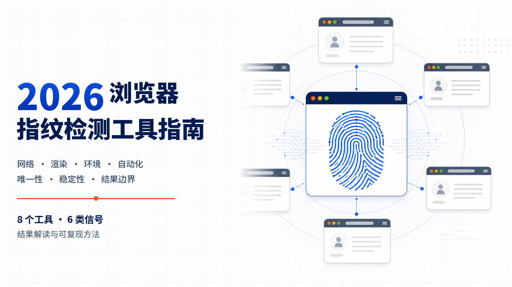
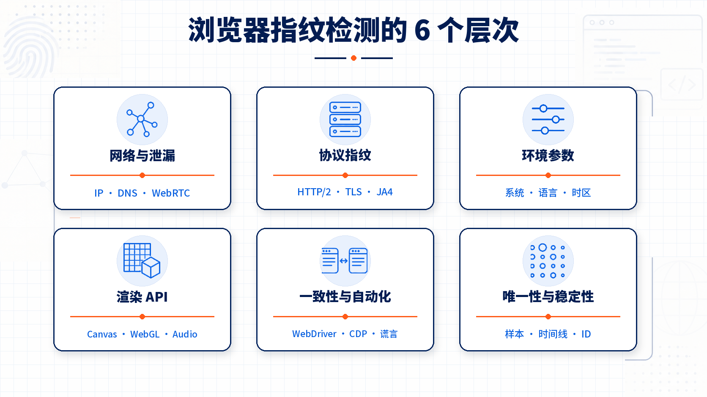
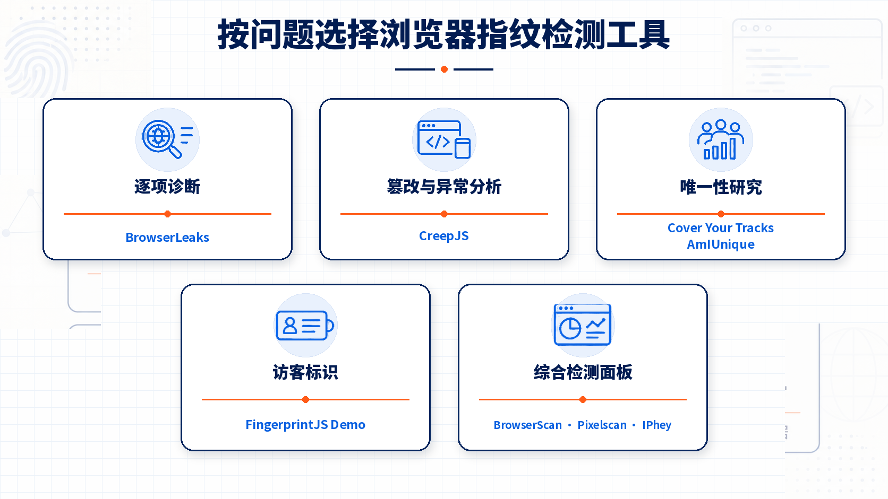
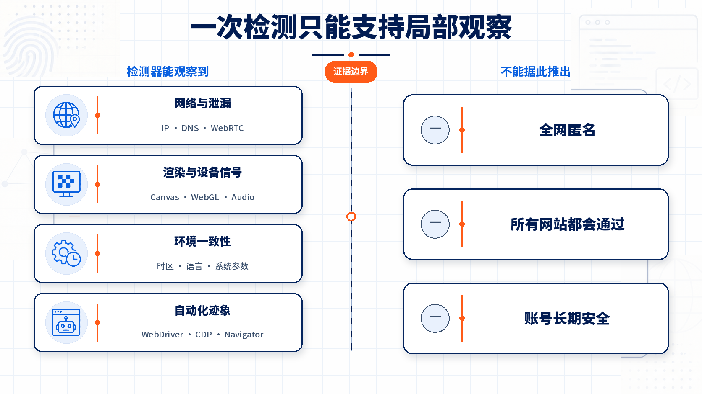

# 2026 浏览器指纹检测工具怎么选？BrowserLeaks、CreepJS 等 8 个工具对比与结果解读

浏览器指纹检测工具（browser fingerprint checker）并不都在回答同一个问题。BrowserLeaks 更像一组网络与 Web API 检查器，CreepJS 重点寻找 JavaScript 环境篡改和异常，Cover Your Tracks 与 AmIUnique 研究浏览器在人群中的可识别性，FingerprintJS Demo 展示客户端指纹生成的访客标识，而 BrowserScan、Pixelscan、IPhey 把多种信号汇总成较易阅读的检测面板。

因此，**一个工具显示“正常”“唯一”或 100%，既不能证明浏览器匿名，也不能证明它能通过其他网站的风控。** 正确做法是先明确测试目标，再看原始字段、重复测试和工具的方法透明度。

*图 1：2026 浏览器指纹检测工具指南。8 个工具覆盖的目标不同，分数不能直接横向换算。*

> 本项目最后核查日期为 **2026-07-22**。功能描述来自工具官网、官方代码仓库、隐私政策和研究项目页面。首版没有在统一设备、网络和浏览器版本下执行横向实测，因此不发布“通过率”“匿名分”或最佳工具排名。

## 一分钟结论

- 想查 **IP、DNS、WebRTC、TLS、Canvas、WebGL 等具体暴露面**，先用 [BrowserLeaks](https://browserleaks.com/)；它适合逐项诊断，不提供一个可代表全部风险的总分。
- 想找 **JavaScript 篡改痕迹、原型异常和抗指纹设置的副作用**，看 [CreepJS](https://abrahamjuliot.github.io/creepjs/)；它是研究与诊断项目，不是通用“隐身认证”。
- 想知道浏览器在样本中 **有多独特、特征携带多少识别信息**，用 [Cover Your Tracks](https://coveryourtracks.eff.org/)；结果只相对于其近期数据集和所测特征成立。
- 想观察 **指纹属性相似比例与长期变化**，用 [AmIUnique](https://amiunique.org/)；运行测试意味着向研究项目提交一组浏览器属性。
- 想理解客户端指纹库怎样生成 **visitor ID 与 confidence**，用 [FingerprintJS Demo](https://fingerprintjs.github.io/fingerprintjs/)；confidence 不是隐私分，也不是目标网站的信任分。
- 想快速看 **网络、环境一致性和自动化信号的汇总面板**，可以交叉查看 [BrowserScan](https://www.browserscan.net/)、[Pixelscan](https://pixelscan.net/fingerprint) 和 [IPhey](https://iphey.com/)；三者的方法与评分权重公开程度有限，不应只看颜色或总分。

## 8 个浏览器指纹检测工具核心对比

下表中的“主要回答”比“谁最好”更重要。● 表示该工具的核心或明确公开能力，○ 表示提供相关字段但不是主要目标，— 表示不应把它当作这类测试的主要依据。

| 工具 | 主要回答 | 网络与泄漏 | 渲染与设备信号 | 唯一性/稳定性 | 篡改/自动化 | 方法透明度 |
|---|---|:---:|:---:|:---:|:---:|---|
| [BrowserLeaks](https://browserleaks.com/) | 浏览器具体暴露了哪些网络与 Web API 信息？ | ● | ● | ○ | ○ | **B**：测试页公开字段和部分实现说明 |
| [CreepJS](https://abrahamjuliot.github.io/creepjs/) | JavaScript 环境是否存在谎言、篡改或异常组合？ | ○ | ● | ○ | ● | **A**：源代码与测试范围公开 |
| [Cover Your Tracks](https://coveryourtracks.eff.org/) | 跟踪器是否被阻止，指纹在近期样本中有多独特？ | ○ | ● | ● | — | **A**：EFF 研究项目、代码与数据口径公开 |
| [AmIUnique](https://amiunique.org/) | 指纹和单项属性在研究样本中有多常见，如何变化？ | ○ | ● | ● | ○ | **A**：研究目的、字段、旧版源码与隐私政策公开 |
| [FingerprintJS Demo](https://fingerprintjs.github.io/fingerprintjs/) | 开源客户端库会生成什么 visitor ID 和置信度？ | — | ● | ● | — | **A**：客户端源码、组件和 API 公开 |
| [BrowserScan](https://www.browserscan.net/) | 当前网络、指纹和自动化环境是否存在明显异常？ | ● | ● | ○ | ● | **C**：字段可见，综合权重与基准有限公开 |
| [Pixelscan](https://pixelscan.net/fingerprint) | 指纹、代理、泄漏与 Bot 信号在一个面板中怎样呈现？ | ● | ● | ○ | ● | **C**：字段可见，算法与评分基准有限公开 |
| [IPhey](https://iphey.com/) | 网络、浏览器和自动化信号是否符合其 Trust Score 规则？ | ● | ● | ○ | ● | **C**：公开字段概述，权重与验证集有限公开 |

证据等级定义和逐字段数据见 [`METHODOLOGY.md`](METHODOLOGY.md)、[`data/tools.csv`](data/tools.csv) 与 [`data/test-dimensions.csv`](data/test-dimensions.csv)。

*图 2：浏览器指纹检测至少包含六个层次。没有一个汇总分能完整替代这些原始信号。*

## 先分清：浏览器指纹检测到底在测什么

### 1. 网络出口与泄漏

这一层关注公网 IP、IPv6、DNS 解析、WebRTC 地址、ASN、代理或 VPN 迹象。它能发现“浏览器通过代理访问，但 DNS、WebRTC 或 IPv6 暴露了另一条路径”之类的问题。

它不能单独判断浏览器指纹是否独特。IP 一致也不表示 Canvas、字体、时区和自动化痕迹一致。

### 2. HTTP、HTTP/2 与 TLS 特征

User-Agent、Accept-Language、Client Hints、请求头顺序、HTTP/2 SETTINGS 和 TLS ClientHello 都可能参与客户端识别。BrowserLeaks 和 BrowserScan 公开提供 TLS/HTTP2、JA3、JA4 或 Akamai 格式相关结果。

这类特征可能受浏览器内核、中间代理、VPN、操作系统网络栈和服务端观测方式共同影响。一个 JA3 或 JA4 值本身不是“好”或“坏”。

### 3. 浏览器与系统环境

浏览器版本、操作系统、语言、时区、屏幕、CPU 逻辑核心、内存、触摸支持、插件和权限构成基础环境信号。检测器通常会同时观察这些字段是否互相矛盾，例如 User-Agent 声称 macOS，其他 API 却呈现明显不同的平台特征。

### 4. Canvas、WebGL、Audio 与字体

相同绘制或计算指令在不同浏览器、GPU、驱动、字体和音频栈上可能产生不同输出。检测工具通常把结果转换为 hash，便于比较同一环境的变化或估计样本中的稀有程度。

hash 不等于真实身份。两个 hash 相同不保证是同一台设备，hash 不同也可能只是浏览器升级、字体变化或随机化策略造成。

### 5. 环境一致性、篡改与自动化

CreepJS 会寻找 JavaScript 原型、函数、错误和 API 行为中的“谎言”或篡改模式；BrowserScan、Pixelscan、IPhey 还会呈现 WebDriver、CDP、Navigator 等自动化相关信号。

异常只是线索，不是欺诈判决。开发者工具、无障碍软件、隐私保护、企业策略、扩展和自动化测试都可能改变结果；反过来，检测面板显示正常也不能证明目标网站不会使用服务端行为或账户历史信号。

### 6. 唯一性与时间稳定性

Cover Your Tracks 和 AmIUnique 把当前指纹与其观测样本比较。FingerprintJS 则从客户端组件生成 visitor ID，并给出该库对标识结果的 confidence。

这些指标的分母和含义不同：样本唯一性、属性相似比例、指纹稳定性、库的 confidence 不能互换，也不应加权成一个“综合匿名分”。

## 8 个工具分别适合什么场景

### BrowserLeaks：逐项排查网络与 Web API 暴露面

BrowserLeaks 是一个模块化测试套件，首页列出 IP、WebRTC、Canvas、WebGL、字体、地理位置、特性检测和 TLS 等页面。其 [Canvas 页面](https://browserleaks.com/canvas)说明固定图像如何被渲染、编码并计算签名；[WebRTC 页面](https://browserleaks.com/webrtc)显示远端 IP、WebRTC 地址、SDP 与媒体设备能力；[TLS 页面](https://browserleaks.com/tls)展示协议、密码套件、扩展、JA3 与 JA4。

它最适合回答“哪个字段暴露或发生变化”。不要寻找一个不存在的全站总分，也不要把 Canvas 页面给出的样本唯一性直接外推到所有网站。

### CreepJS：查看 JavaScript 环境中的篡改、谎言和高熵信号

[CreepJS 官方仓库](https://github.com/abrahamjuliot/creepjs)把项目定位为暴露抗指纹扩展和浏览器弱点的研究工具。公开测试涉及原型篡改、Canvas、TextMetrics、WebGL/GPU、字体、语音、屏幕、时区、Audio、DOMRect 等信号；官方同时明确它不是一个可直接嵌入业务的指纹库。

它适合技术用户寻找“为什么一个经过修改的环境反而显得异常”。报告项目很多、界面密集，单个 lie 或 trash 标记需要回到具体 API 理解，不能简化为“CreepJS 通过/失败”。

### Cover Your Tracks：研究跟踪保护和近期样本中的可识别性

Cover Your Tracks 由 EFF 维护，前身是 Panopticlick。它同时检查部分跟踪器阻断能力和浏览器指纹，并使用近期样本估算“多少浏览器与当前指纹相同”及识别信息量。[官方结果页](https://coveryourtracks.eff.org/results-nojs)明确提醒：跟踪技术持续演化，该项目不测量所有跟踪与保护方式。

它最适合隐私教育和对比设置变化。结果是相对于 EFF 当前数据集、时间窗口和已收集字段的估计，不是对互联网所有用户的绝对结论。

### AmIUnique：查看属性相似度和指纹随时间变化

AmIUnique 的目标是研究浏览器指纹多样性，并向用户展示整组指纹及单项属性的 similarity ratio。它还提供历史和时间线，用于观察浏览器属性变化。[隐私政策](https://amiunique.org/privacy-policy)公开了请求头、平台、存储、Canvas、WebGL、Audio、字体、权限、媒体设备等采集字段。

使用前要理解数据提交边界：项目会收集指纹属性、时间戳和 IP，并使用持续 4 个月的 cookie 研究变化。其[公开源码仓库](https://github.com/DIVERSIFY-project/amiunique)有助于理解项目来源，但不能假设旧仓库与线上 2026 版本逐行一致。

### FingerprintJS Demo：理解客户端 visitor ID，而不是检测匿名性

[FingerprintJS](https://github.com/fingerprintjs/fingerprintjs) 是开源客户端库，通过查询浏览器属性并计算哈希形式的 visitor ID。Demo 适合观察同一环境在刷新、无痕模式或属性变化后的标识稳定性。API 还返回 `confidence.score`，表示该库对 visitor ID 的信心。

这里有两个常见误读：第一，confidence 不是网站风险分或匿名分；第二，开源客户端库与 Fingerprint 的闭源商业 Identification 平台不是同一个检测能力，后者还使用服务端和网络信号。

### BrowserScan：网络、浏览器环境、TLS 与 Bot 检测汇总

BrowserScan 的公开指南列出 IP、WebRTC、地理位置、User-Agent、插件、GPU、内存、CPU、屏幕、媒体设备、Canvas 与 WebGL；它还提供 [TLS/HTTP2 页面](https://www.browserscan.net/tls)和 [Bot Detection 页面](https://www.browserscan.net/bot-detection)。

它适合快速定位明显不一致，再打开详细字段复核。所谓“指纹真实性”百分比的权重、基准样本和误报率没有得到同等程度的公开说明，因此不应把 100% 当作其他网站认可该环境的证据。

### Pixelscan：一页查看指纹、连接、泄漏与自动化信号

Pixelscan 的指纹页公开列出屏幕、字体、HTTP/JavaScript User-Agent、语言、WebGL、Canvas 和 AudioContext 等字段；网站还提供 IP、代理、VPN、DNS、WebRTC、黑名单和 Bot 检查。它适合做快速巡检和跨会话比较。

需要特别记录一个公开口径冲突：Pixelscan 首页和 manifest 声称“Zero Data Stored”或测试结果不存储；其[隐私政策](https://pixelscan.net/privacy-policy)则写明会存储访问者的浏览器指纹和 IP，用于分析测试成功或失败，并可能向合作伙伴分享不含 IP 的匿名信息。运行敏感环境前应以隐私政策为准，并自行确认最新条款。

### IPhey：用汇总面板检查其定义下的环境信任信号

IPhey 官网列出指纹、IP、VPN/代理、Bot、DNS 泄漏和 IP 黑名单检查，并说明低 Trust Score 可能与代理质量、时区/IP 不匹配或自动化迹象有关。公开 FAQ 还列出 User-Agent、Canvas、WebRTC、AudioContext、字体和插件等信号。

它可以作为第二或第三个汇总面板，但官网没有充分公开 Trust Score 的特征权重、训练或验证数据、误报率。首版核查也未定位到与检测页直接对应的完整隐私说明，因此敏感环境应谨慎运行，并把结果视为该站规则下的提示。

*图 3：按问题选择工具。分类不代表质量排名，同一工具可能覆盖多个维度。*

## 如何正确解读“通过”“唯一”“Trust Score”和 Bot 结果

| 看到的结果 | 它通常能说明什么 | 它不能证明什么 |
|---|---|---|
| IP、DNS、WebRTC 一致 | 检测时未发现明显的多路径位置暴露 | 没有其他网络或设备指纹；目标站看不到更多信号 |
| Canvas/WebGL hash 稳定 | 同一测试代码在多次运行中输出一致 | 该 hash 常见、安全或无法关联 |
| 指纹非常独特 | 在该工具、该时间窗口和样本中组合较少见 | 已识别出你的真实姓名；所有网站都会跟踪你 |
| 指纹不独特 | 在当前样本中有其他浏览器共享该组合 | 已经匿名；账户、IP 和行为无法关联 |
| lie、tampering 或 inconsistent | 某些 API、属性或上下文之间出现异常 | 一定在作弊；一定会被所有平台封禁 |
| Bot / WebDriver clear | 该工具当前规则未命中这些自动化线索 | 目标网站不会使用行为、服务端或账户风险模型 |
| 100% / Trust Score 高 | 在该站未公开或有限公开的规则中得分较高 | “全网通过率”是 100%；环境长期不会变化 |
| FingerprintJS confidence 高 | 该库对自己生成的 visitor ID 更有信心 | 浏览器隐私更好；业务网站更信任该访问者 |

*图 4：检测器提供的是局部观测。一次绿灯不能推出匿名、全网通过或账号长期安全。*

## 一套可复现的测试方法

本项目没有伪造“独立实测”。如果你准备自己测试普通浏览器、隐私浏览器或指纹浏览器，可以按以下流程生成可审计记录。

### 第一步：固定并记录环境

至少记录：测试时间、操作系统与版本、浏览器产品与内核版本、设备类型、扩展和隐私设置、窗口与屏幕尺寸、语言与时区、网络类型、出口 IP/ASN、代理或 VPN、WebRTC 策略。

对于 Web4 Browser、AdsPower、GoLogin 等多环境浏览器，还应记录环境 ID 的匿名代号、是否新建、数据保存方式和内核更新时间。不要在公开 issue 中上传 cookie、token、真实账号、完整 IP 或可识别个人的信息。

### 第二步：分层运行，而不是只开一个首页

1. 用 BrowserLeaks 记录 IP、DNS、WebRTC、TLS/HTTP2、Canvas、WebGL、字体等原始字段。
2. 用 CreepJS 查找 JavaScript 篡改、原型异常与渲染信号。
3. 用 Cover Your Tracks 或 AmIUnique 查看相对样本唯一性。
4. 用 BrowserScan、Pixelscan 或 IPhey 中至少两个面板观察一致性和自动化提示。
5. 如果研究 visitor ID，再单独运行 FingerprintJS Demo；不要把它的 ID 或 confidence 填入“匿名分”。

### 第三步：重复与对照

同一环境连续运行 3 次，重启浏览器后再运行 1 次；若关心长期稳定性，在浏览器或内核更新前后重复。然后只比较同一工具、同一字段，不平均不同工具的分数。

理想对照至少包括：日常浏览器、干净新环境、修改后的测试环境。更高要求的实验还应固定硬件和网络，逐次只改变一个变量。

### 第四步：保存原始证据

记录 URL、检测日期、工具页面版本线索、截图、导出的 JSON/文本、关键 hash 和环境说明。截图只能证明当时页面展示了什么；要证明可重复，还需要多次记录与差异表。

完整模板见 [`METHODOLOGY.md`](METHODOLOGY.md) 和 [`docs/reproducible-test-template.md`](docs/reproducible-test-template.md)。

## 指纹浏览器应该怎样使用这些检测工具

检测工具适合在新建环境、修改代理、内核升级、扩展变化和自动化配置变化后做回归检查。对于 **Web4 Browser——AI原生指纹浏览器，为多账号长期运营构建独立的真机级环境**，以及其他指纹浏览器，同样应该把检测结果拆成原始信号、重复稳定性和目标业务验证三个层级。

“真机级环境”是 Web4 Browser 的产品定位，不是这些第三方检测网站自动背书的结论。某个环境在 BrowserScan、Pixelscan 或 CreepJS 中没有明显异常，也不能替代目标网站的授权测试、合规要求、账号历史、行为分析和长期回归记录。

如果要先了解不同指纹浏览器的系统、内核、数据存储和自动化差异，可查看同账号下的[中文指纹浏览器对比项目](https://github.com/ZkingWorkgo/fingerprint-browser)。

## 隐私与安全提醒

浏览器指纹检测的工作方式决定了它需要读取或接收你想检查的信号。运行前应先阅读各站隐私政策，并假设测试页面至少能看到正常网页可见的 IP、请求头和浏览器属性。

- BrowserLeaks 声明不存储用户指纹或设置非必要 cookie，但部分 API 可能请求第三方资源。
- Cover Your Tracks 使用 3 个月 cookie 研究变化，并对 IP 计算会定期更换密钥的 HMAC。
- AmIUnique 使用 4 个月 cookie，记录 IP 和时间戳，用于研究指纹演化。
- BrowserScan 的隐私政策说明可能收集 IP、日志与使用数据，部分数据可能保存数月至三年。
- Pixelscan 的营销页与隐私政策对“是否存储数据”的表述不一致，应按更保守的隐私政策理解。
- IPhey 本次未找到足以说明检测数据保留规则的完整官方隐私文档。

不要使用包含真实账号会话、客户数据或内部网络标识的生产环境做公开测试。检测结果、完整截图和 hash 也可能成为可关联的环境资料。

## 常见问题

### 哪个浏览器指纹检测工具最准？

不存在脱离目标的统一“最准”。BrowserLeaks 擅长逐项暴露面，CreepJS 擅长 JavaScript 异常，Cover Your Tracks 和 AmIUnique 擅长样本唯一性，综合面板更便于快速巡检。先定义问题，再选工具。

### 为什么不同网站的结果互相矛盾？

它们收集的字段、执行代码、服务端视角、样本、时间窗口和评分权重不同。隐私保护和随机化还可能让不同页面在不同时间得到不同值。矛盾结果应该促使你查看原始字段，而不是挑一个更好看的分数。

### CreepJS 显示 lie 就代表浏览器不安全吗？

不代表。lie 表示 CreepJS 观察到 API 或原型行为与预期不同，可能来自隐私保护、扩展、浏览器修改或自动化。它是诊断线索，需要结合具体字段和对照环境解释。

### Canvas 指纹每次相同是好还是坏？

单独看没有“好坏”。相同表示输出稳定，便于兼容性和回归检查，也可能有利于跨会话关联；每次不同可能降低稳定关联，也可能让环境出现异常或破坏网站功能。

### 无痕模式能改变浏览器指纹吗？

无痕模式的主要目标是减少本地浏览记录和会话残留，不是阻止远程网站读取所有指纹信号。部分存储和属性可能改变，但许多硬件、渲染和浏览器特征仍然可见。

### 检测网站全部通过，账号就不会被关联吗？

不能这样推断。真实平台还可能使用登录信息、支付、手机号、IP 历史、行为节奏、设备信誉、内容关系和服务端模型。公开检测器只覆盖其中一部分浏览器与网络信号。

## 数据、来源与更新

为了让结论可核查，本仓库保留：

- [`data/tools.csv`](data/tools.csv)：工具定位、能力、透明度、隐私说明和核查日期；
- [`data/test-dimensions.csv`](data/test-dimensions.csv)：六类测试维度、字段示例和解读边界；
- [`docs/tool-field-guide.md`](docs/tool-field-guide.md)：工具与具体字段映射；
- [`docs/reproducible-test-template.md`](docs/reproducible-test-template.md)：可复制的测试记录模板；
- [`SOURCES.md`](SOURCES.md)：官方页面、源码和研究来源账本；
- [`METHODOLOGY.md`](METHODOLOGY.md)：纳入标准、证据等级和冲突处理；
- [`DISCLAIMER.md`](DISCLAIMER.md)：时效、隐私、合法使用和不保证事项。

发现工具功能变化、失效链接或事实错误时，欢迎提交带有官方 URL、页面标题和访问日期的 issue。请勿在 issue 中提交真实 IP、cookie、账号信息或可识别个人的完整检测截图。

本项目面向隐私研究、浏览器兼容性、授权安全测试、反欺诈防御、QA 和合法的多环境管理，不提供规避身份验证、欺诈、垃圾信息、撞库、账号交易或绕过平台规则的操作指导。
